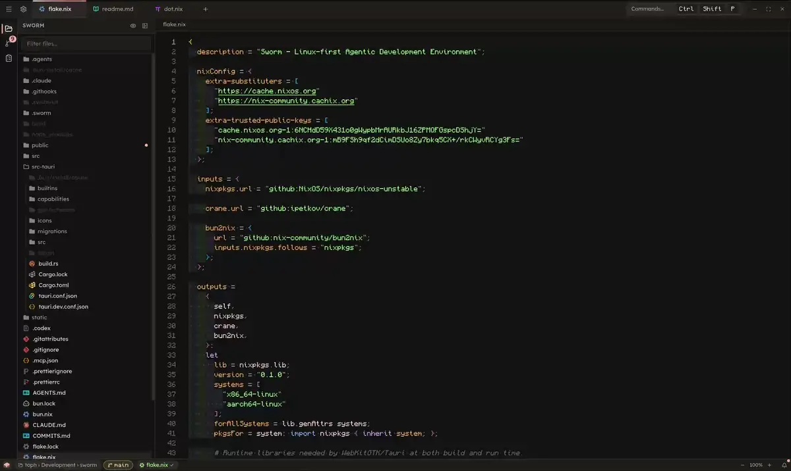
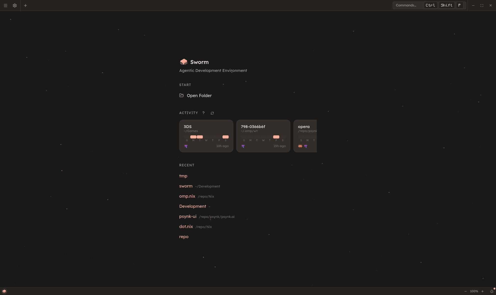
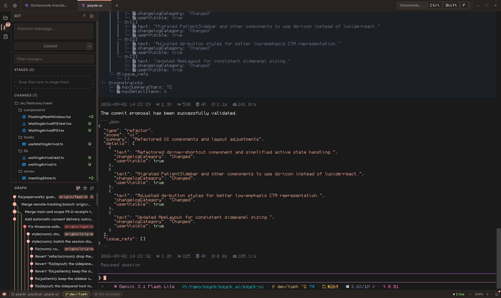
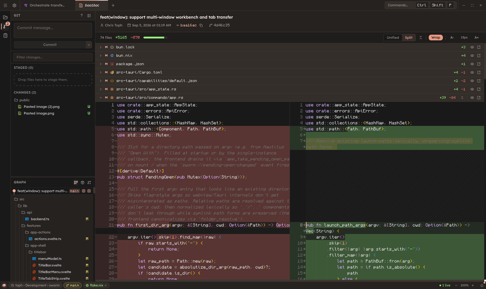
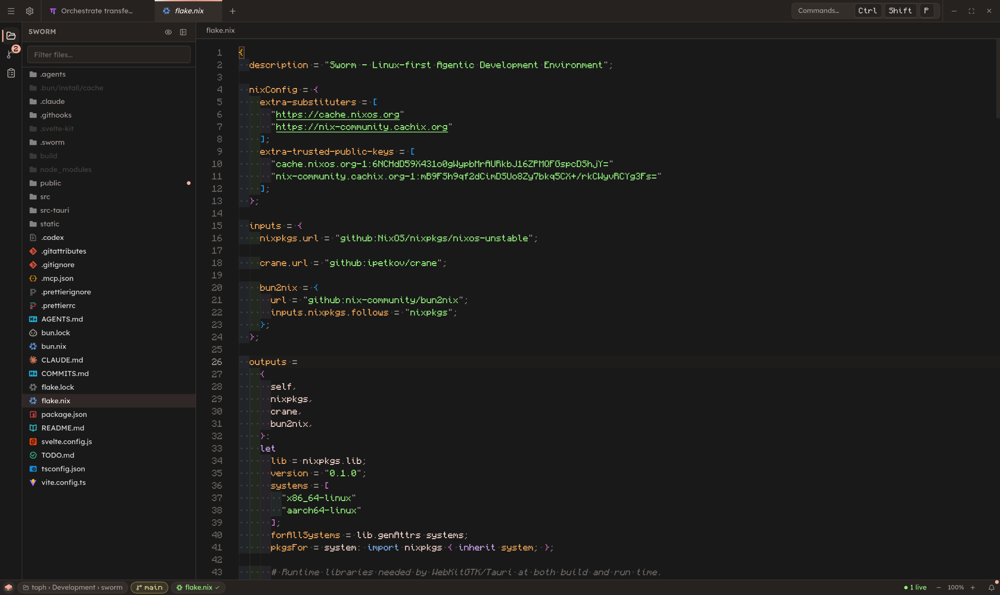
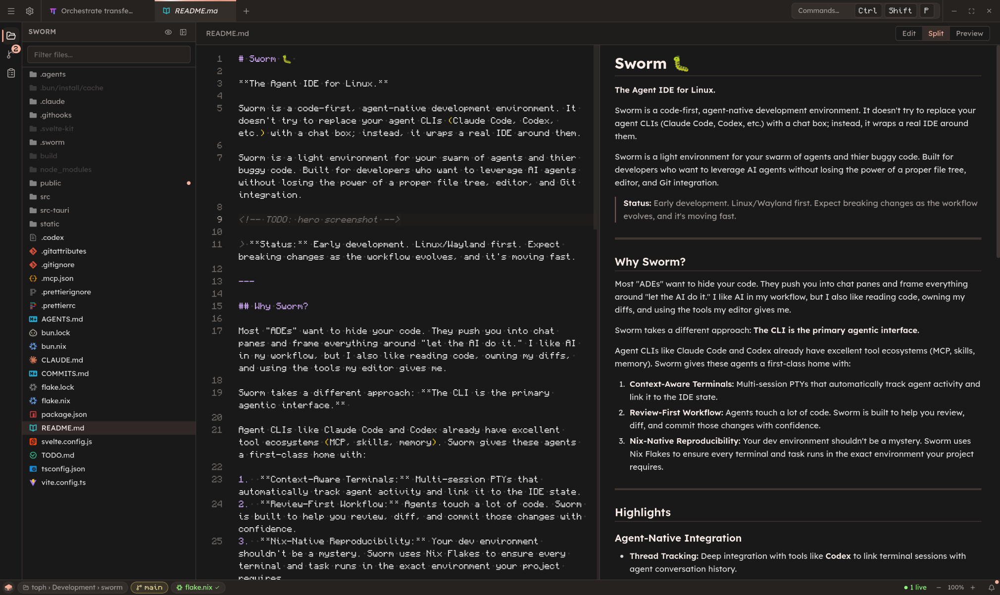
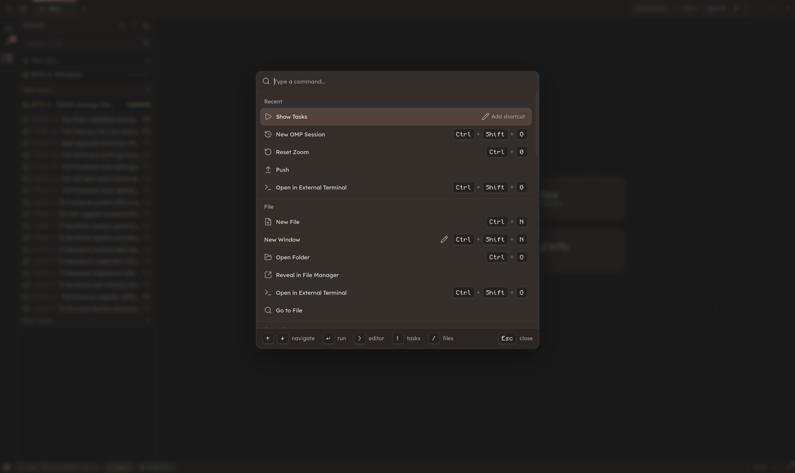
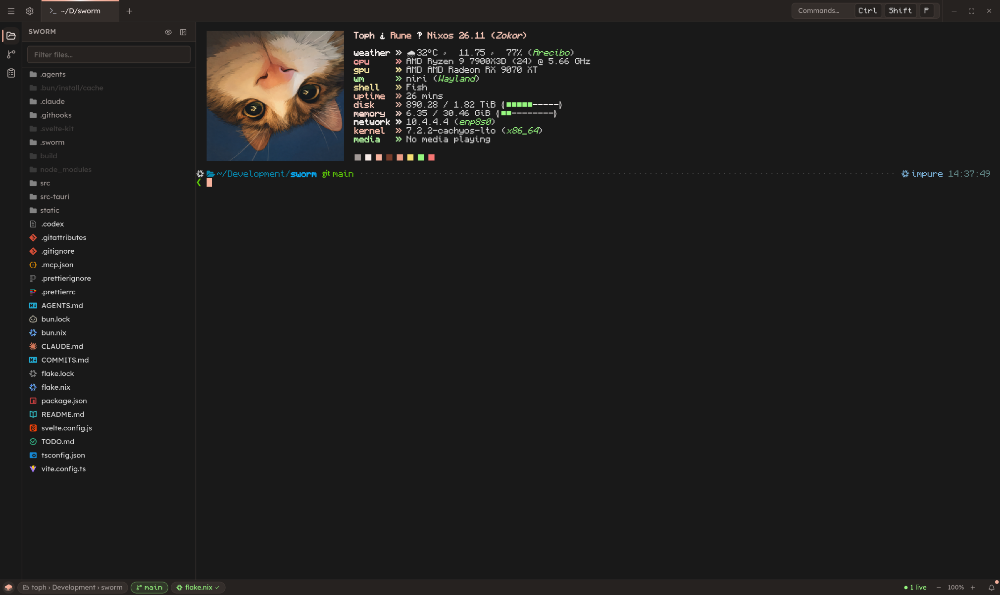
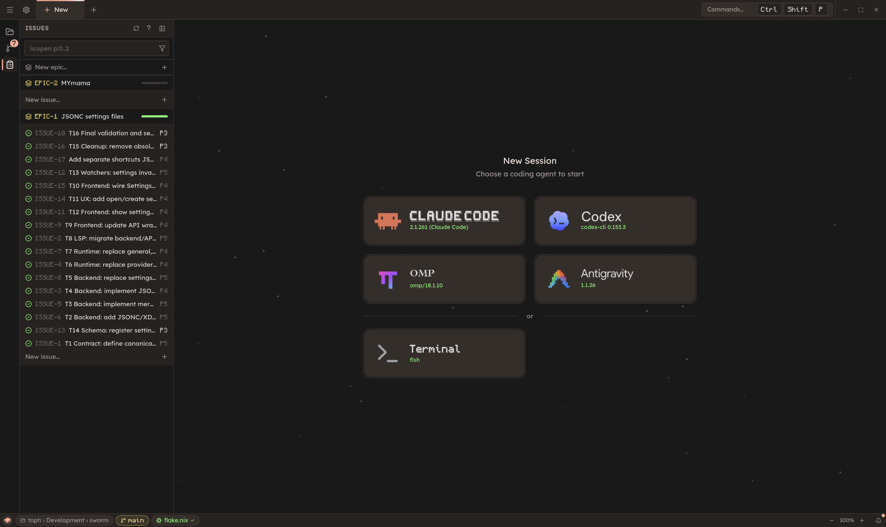

# Sworm 

**A Linux desktop workspace for coding-agent CLIs.**

Keep using Claude Code, Codex, OMP, or Antigravity in the terminal. Sworm puts a file editor, Git diffs, and local issues alongside them, so you can follow the work and review changes without bouncing between separate apps.

Tabs can belong to different repositories. Switch tabs, and the file tree and Git sidebar follow.

Sworm is a passion project in active development, built around a simple idea: keep the agent's own interface, and make the work around it easier.



## Try it

With [Nix](https://nixos.org/) and flakes enabled:

```sh
nix run github:tophc7/Sworm
```

Install and authenticate whichever agent CLI you want to use separately. Sworm detects supported installed agents; you can also open a regular terminal using your login shell.

<details>
<summary>Install on Debian or Arch</summary>

### Debian

Download the `.deb` for your architecture from [GitHub Releases](https://github.com/TophC7/Sworm/releases/latest), then install:

```sh
sudo apt install ./sworm_*_$(dpkg --print-architecture).deb
```

Available for Debian 12 on `amd64` and `arm64`. To update, install a newer release with the same command.

### Arch

Download `sworm-bin-<commit>.tar.gz` from [GitHub Releases](https://github.com/TophC7/Sworm/releases/latest) into an empty directory, then unpack and install:

Using `yay`:

```sh
tar -xf sworm-bin-*.tar.gz
yay -Bi .
```

Using `makepkg`:

```sh
sudo pacman -S --needed base-devel
tar -xf sworm-bin-*.tar.gz
makepkg -si
```

Supports `x86_64` and `aarch64`.

</details>

## Why I built Sworm

I've always liked VS Code's straightforward workflow. I was much less happy with it's use of Electron, especially on Wayland, and wanted something that felt familiar without relying on it.

As coding agents became part of my daily work, I found I really only needed a file tree, Git diffs, an editor, and a terminal. I wasn't using any of the rest of the "IDE" or its extensions anymore; but VS Code's workflow was still the only that worked for me.

Sworm grew out of that: a workspace for the parts I actually use when working with agents. It's evolved into a tab-driven workflow of its own, while keeping enough familiarity that VS Code users should feel at home.

## What you can do

### Keep agents and repositories in reach

Run agent sessions and ordinary terminals in tabs, with each tab tied to its folder. The sidebar follows the selected tab, and a folder stays open until its last tab closes. Open multiple windows and drag tabs between them.

The home dashboard reads local Claude Code, Codex, and OMP histories to show projects with a seven-day activity heatmap, so you can find where you left off.

<details>
<summary>📷 See the dashboard and an agent workspace</summary>





</details>

### Edit and review the work

Browse files, edit code, and review changes before committing:

- Side-by-side or unified Git diffs, with adjustable text size and word wrap.
- Separate staged and working changes, per-file change counts, and commit composition.
- A Git graph for browsing commits, branches, and merges.
- Monaco code editing, plus Shiki highlighting for Nix, Svelte, and Fish.
- Markdown editing with a live preview styled to match GitHub as closely as possible.
- A file tree with filtering, Git markers, and drag-and-drop.

<details>
<summary>📷 See Git diffs, the code editor, Markdown preview, and command palette</summary>









</details>

Use `Ctrl+Shift+P` for workbench commands or `Ctrl+P` to find files. The command palette also has modes for editor commands (`>`), runnable tasks (`!`), and files (`/`). Shortcuts are customizable.

### Use your project's Nix environment

Sworm detects `flake.nix`, `shell.nix`, and `default.nix`. Select and evaluate an environment from the status bar; once ready, it is used for new terminals, agent sessions, and runnable tasks. Without a ready Nix environment, sessions use the host environment.

The status bar shows the current folder, Git branch, Nix environment status, and live session count.

<details>
<summary>📷 See a terminal session</summary>



</details>

### Keep local tasks alongside the code

Track issues with priorities, group them into epics, and see progress in the sidebar. Agents can query, create, and update issues through a local socket API rather than editing the database directly.

<details>
<summary>📷 See the session launcher and issues sidebar</summary>



</details>

## Worth knowing

- **Active development, Linux-first.** Expect rough edges and changes as the project grows. I do daily-drive it however, so it's stable enough.
- **Sessions in the same folder share its working tree.** Tabs do not create isolated worktrees.
- **Your agent is still your agent.** Sworm runs the CLI itself; model information and other output inside its terminal come from that CLI.

## Development

Nix provides the development toolchain and Linux desktop dependencies:

```sh
git clone https://github.com/tophc7/Sworm.git
cd Sworm
nix develop
bun install
bun run app:dev
```

Build and run the Nix package from the checkout:

```sh
nix build
nix run .
```

Sworm uses [Tauri v2](https://tauri.app/) and Rust for the desktop runtime, with the system Git CLI and SQLite. The interface is built with Svelte 5, SvelteKit, and Tailwind CSS v4; editing uses Monaco and Shiki, and terminals use xterm.js. Nix defines the development environment and packaging.

## Feedback

If you try Sworm, I'd like to hear what works for you and what gets in the way. [Open an issue](https://github.com/tophc7/Sworm/issues) with bugs, ideas, or how you use coding agents.

## Credits

- [Emdash](https://github.com/generalaction/emdash) was an early architectural inspiration for Sworm's agent-focused workspace.
- [VS Code](https://code.visualstudio.com/) shaped the workflow and UI familiarity I wanted to keep. Sworm also uses Microsoft's [Monaco Editor](https://microsoft.github.io/monaco-editor/), the editor behind VS Code.

## License

[AGPL-3.0-or-later](./LICENSE)
